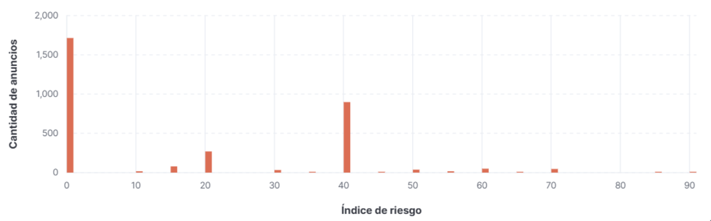
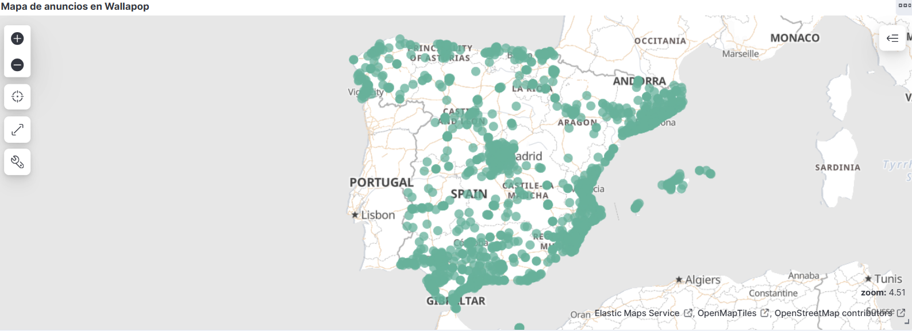
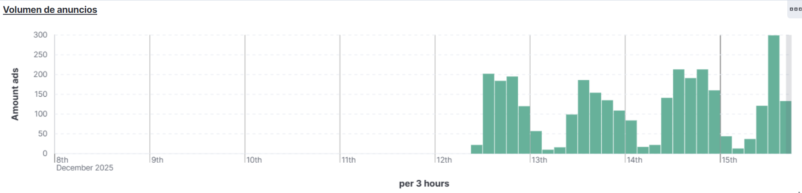
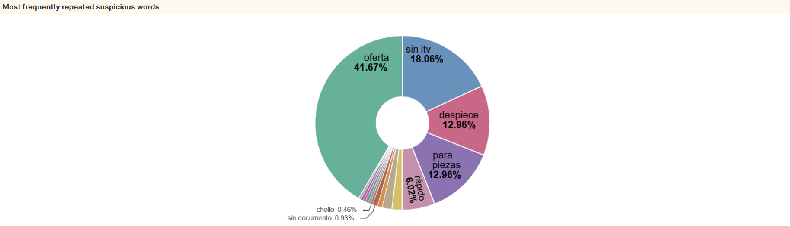

### 📊 Kibana Dashboards – Fraud Radar

A continuación se muestran algunas visualizaciones clave obtenidas en Kibana a partir de los datos recolectados y enriquecidos desde la API de Wallapop. Estas visualizaciones constituyen el Fraud Radar del sistema.

### 🚨 Anuncios con mayor riesgo

Visualización de anuncios con risk score elevado, calculado a partir de anomalías de precio, palabras clave sospechosas y comportamiento del vendedor. Permite identificar rápidamente los anuncios potencialmente más problemáticos.

### 🌍 Distribución geográfica de anuncios
Mapa geográfico que muestra la localización de los anuncios de motocicletas en España, utilizando el campo location.geopoint. Es útil para detectar concentraciones anómalas de anuncios de bajo precio o alto riesgo.

### ⏱️ Volumen de anuncios en el tiempo
Evolución temporal del número de anuncios publicados. Esta visualización permite identificar picos de actividad inusuales que pueden estar asociados a comportamientos sospechosos.

### 🔑 Palabras clave sospechosas
Frecuencia de aparición de palabras clave consideradas sospechosas (por ejemplo: “urgente”, “sin papeles”, “despiece”). Estas señales textuales contribuyen al cálculo del riesgo de cada anuncio.

